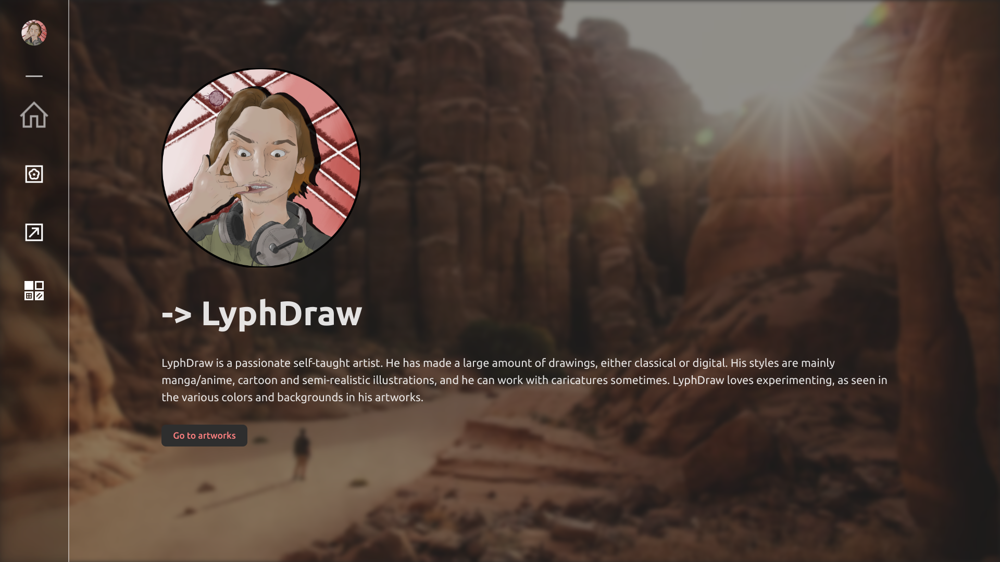
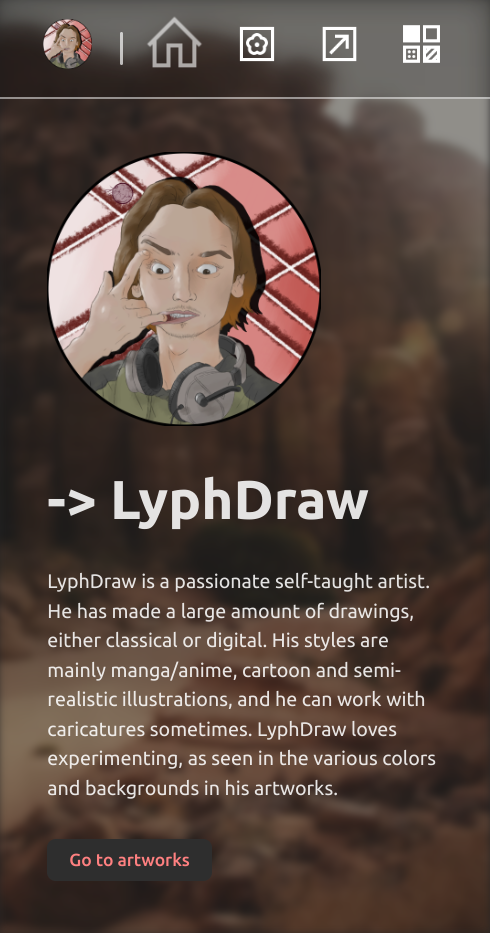

# LyphDraw-portfolio

    
    

## Description
I'm making this for an artist friend.   
It's made using [Vite](https://vitejs.dev/)+[Vue](https://vuejs.org/), vanilla JavaScript. The css is fully handmade.

Issues and PRs are welcome btw ^^

## Features
- Navigation through the different pages is made easy through an intuitive navbbar.
- The website is fully responsive, allowing displays from large screens to small mobile screens.
- Artworks can easily be added through the [artworks.json](./src/assets/artworks.json) file.
